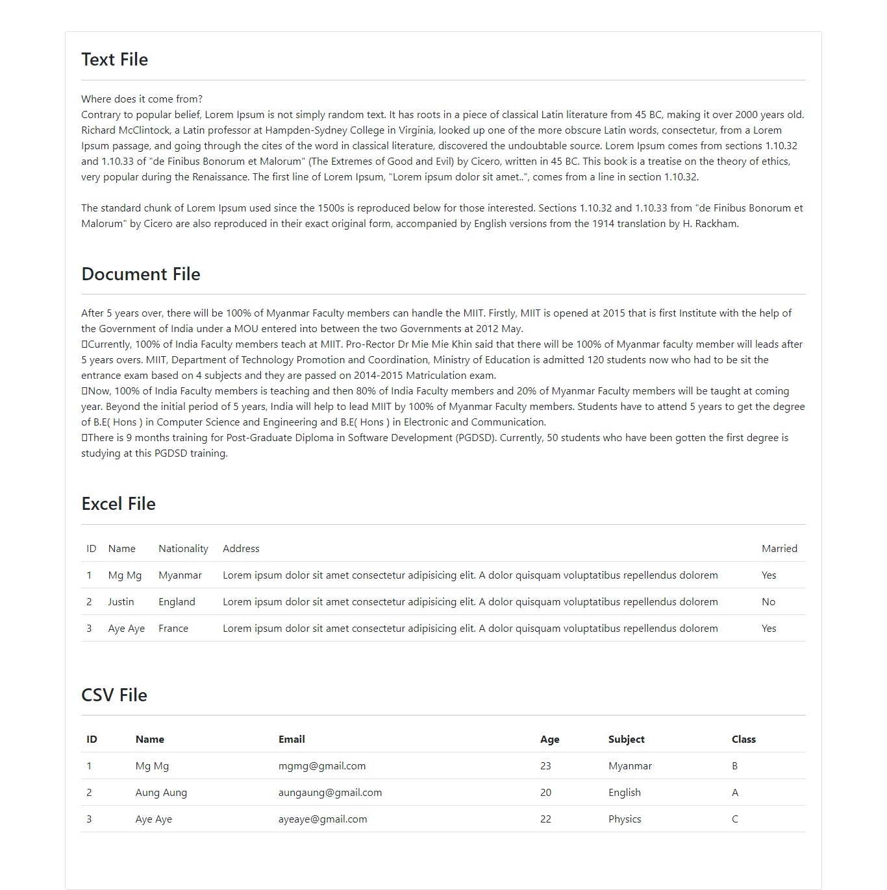

# Tutorial 05

## Read Excel, CSV, Doc And Text files.

## Folder Structure

```
.
├── cSS/
│   ├── reset.css
│   └── style.css
├── demo/
│   └── preview.png
├── files/
│   └── sample.csv
│   └── sample.doc
│   └── sample.txt
│   └── sample.xlsx
├── libs 
│   └──  bootstrap-5.0.2
├── index.php
└── README.md
```


